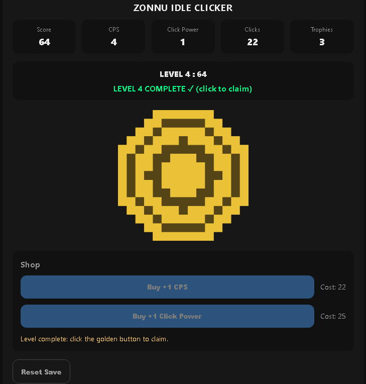
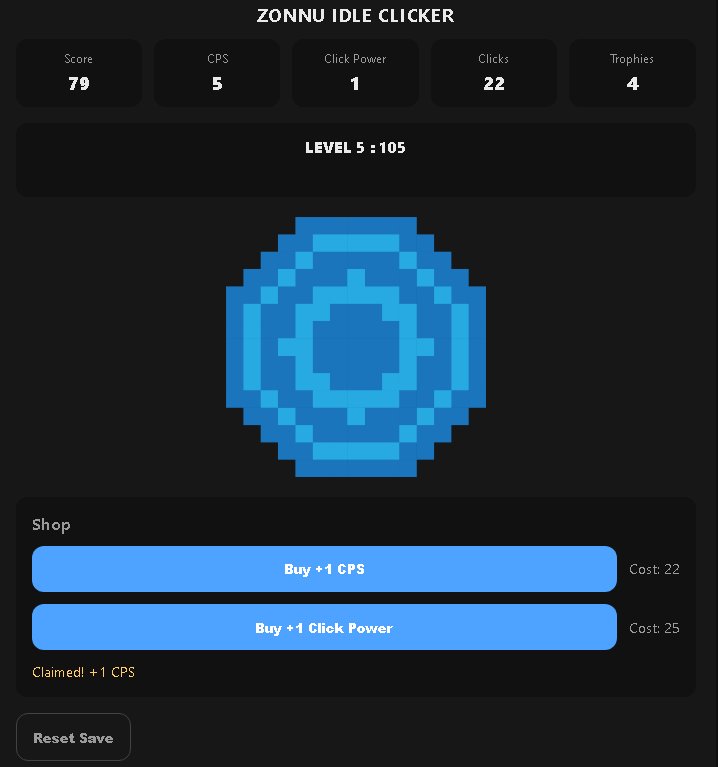

# Zonnu Idle Clicker

Small idle/clicker game built with vanilla HTML/CSS/JS.
Click to earn score, buy upgrades, and clear levels to earn trophies.

## Live Demo
- GitHub Pages: https://zonnu.github.io/Zonnu-Idle-Clicker/

## Features
- Click to gain score (click power)
- Idle income (CPS)
- Level system with claim mechanic (golden button)
- Simple shop (CPS / click power)
- Auto-save (localStorage)
- Offline gains (capped at 8 hours)

## Controls
- Click the main button to gain score
- When the button turns gold, click it to claim the level
- Use the shop buttons to buy upgrades

## Tech
- HTML / CSS / JavaScript (vanilla)
- No frameworks, no dependencies

## Run locally
1. Open `index.html` in your browser
2. Or use VS Code Live Server

## Roadmap
- More upgrades (multiplier / crit)
- Visual polish and feedback

## Screenshots

